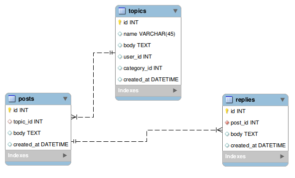

# PostgreSQL BlogPost API

This API provides a backend for a blogging platform, utilizing PostgreSQL for data storage. It supports CRUD operations on three main resources: topics, posts, and replies, mimicking the structure of a real-world blogging platform.

## Features

CRUD operations for topics, posts, and replies.
Associations between topics, posts, and replies.
Database seeding for initial setup.
Getting Started
These instructions will get you a copy of the project up and running on your local machine.

## Prerequisites

Node.js
PostgreSQL
An API testing tool like Postman

## Installation

Clone the repository
Copy code `git clone <repo link>`
`cd` into the directory
Install dependencies `npm install`

## Set up PostgreSQL database

Ensure your PostgreSQL database is running.
Configure environment variables
Create a .env file in the root directory. Add the following line, replacing <your_database_connection_string> with your actual connection string:

plaintext
Copy code
POSTGRES_DATABASE_URL=<your_database_connection_string>
Seed the database

bash
Copy code
npm run seed
Running the Server
Start the server with:

bash
Copy code
npm start
The server will run on http://localhost:8080 or a port specified by your environment.

## API Endpoints

Below are the available endpoints:

### Topics

Each topic has many posts and replies.

| HTTP Method | Endpoint    | Description                |
| ----------- | ----------- | -------------------------- |
| GET         | /topics     | Fetch all topics           |
| POST        | /topics     | Create a new topic         |
| GET         | /topics/:id | Fetch a single topic by ID |
| PUT         | /topics/:id | Update a topic by ID       |
| DELETE      | /topics/:id | Delete a topic by ID       |

### Posts

Each post belongs to a topic and has many replies.

| HTTP Method | Endpoint   | Description               |
| ----------- | ---------- | ------------------------- |
| GET         | /posts     | Fetch all posts           |
| POST        | /posts     | Create a new post         |
| GET         | /posts/:id | Fetch a single post by ID |
| PUT         | /posts/:id | Update a post by ID       |
| DELETE      | /posts/:id | Delete a post by ID       |

### Replies

Each reply belongs to a post.

| HTTP Method | Endpoint     | Description                |
| ----------- | ------------ | -------------------------- |
| GET         | /replies     | Fetch all replies          |
| POST        | /replies     | Create a new reply         |
| GET         | /replies/:id | Fetch a single reply by ID |
| PUT         | /replies/:id | Update a reply by ID       |
| DELETE      | /replies/:id | Delete a reply by ID       |

## Testing the API

Test the API endpoints using Postman or another API testing tool by sending requests to http://localhost:8080 followed by the endpoint path.

For example, to create a new post, send a POST request to http://localhost:8080/posts with a JSON body containing the post details.

Note: You should replace "attachment:image.png" with the actual image path or URL.

## Contributing

Contributions are welcome. Please follow the established coding standards and include tests for new or changed functionality.

## License

This project is licensed under the MIT License. See the LICENSE file for details.
